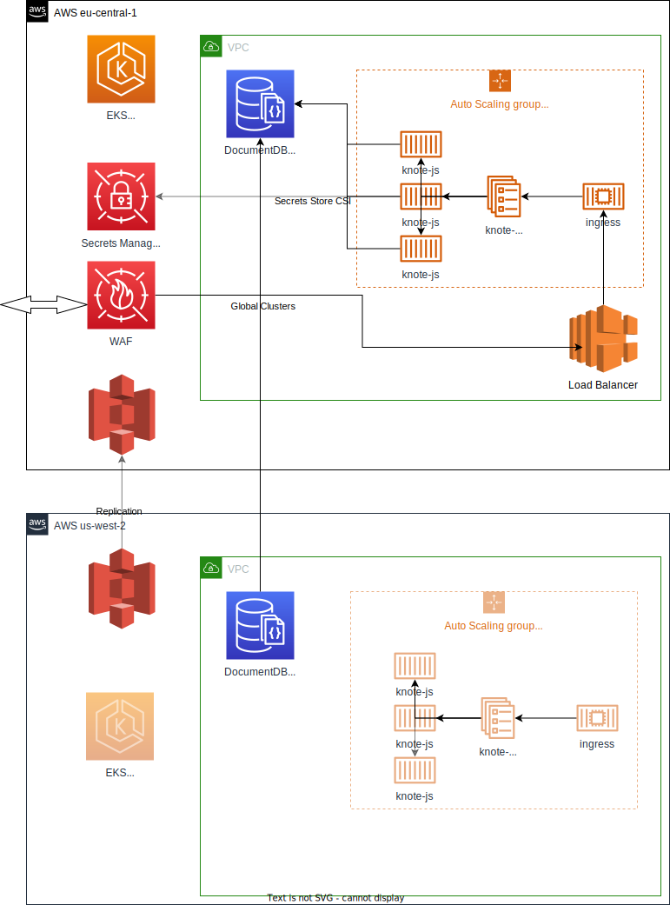



## Introduction

## Continuous Integration

**Testing phase:**
- tflint for Terraform linting
- terraform plan . Saving the plan to execute it at the deployment phase.
- hadolint for Dockerfile validation
- application test, e.g. `npm run test`

**Building phase:**
- application build
- Container image build.
- Push the image to a "production" environment from the main branch,
  every other branch to the "dev" environment. Use the commit short sha
  as the tag.

**Deployment phase (DEV):**

- `terraform apply` . That's it.

**Phased rollout (PROD):**

- In the CI/CD tool, an input field/button is provided to do a deployment with
a parameter of the rollout percentage.
- The traffic can be split between users too. E.g. beta testers with a special
cookie value or auth token would go to the new service, regular users to the old
one.
- It is possible to create an automatic percentage increase based on application
metrics. However this can be complicated to implement because a good baseline
is required and enough traffic to have statistical significance.

### Notes on GitOps

- How to do continuous deployment without an extra git commit?
- How not to overload the Git server with periodic pulls when there are many
deploylment sources?
- Phased rollout has a state of the percentage or other criteria that
determines the traffic shaping. Doing this via a git commit would end up in
complicated rules on when _not_ to trigger a build.

## EKS architecture

## Disaster Recovery

- No state is stored in the cluster, so recoverable from a failure.
- AWS DocumentDB global cluster spans at least two AWS Regions. The primary
region supports a cluster that has one primary (writer) instance and 2 replica
instances, while a secondary region runs a one read-only cluster made up
one replica instance. (A global cluster can have up to five secondary regions.)
- The DocumentDB is spread across the AZ of the region.

With this architecture, we face
- Subsecond maximum data loss at an outage of one instance or AZ.
- Recovery Time Objective (RTO) of under a minute
- Recovery Point Objective (RPO) is typically measured in seconds, but this 
depends on the lag across the network at the time of the failure

## AWS Region loss

At an event of a complete loss of the `eu-central-1` AWS region:

- Because we don't store state in the EKS cluster, a simple change of the
region to `us-west-2` in the Terraform config will be enough to restore the
cluster.

- [Promote the AWS DocumentDB](https://docs.aws.amazon.com/documentdb/latest/developerguide/global-clusters-disaster-recovery.html) in the `us-west-2` region as primary.
- Import current status the AWS DocumentDB in `us-west-2` into the Terraform
state.
- Run the `terraform plan` manually to see if there is deviation or further
parameters to import.
